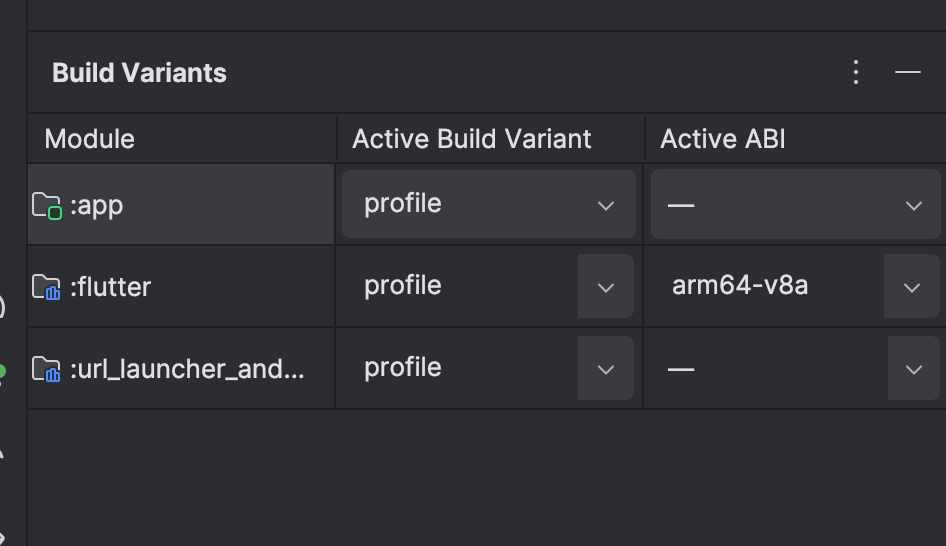
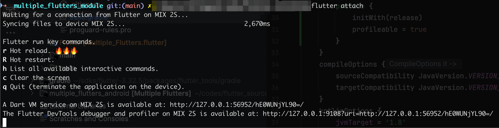

## Motivation

这是一篇很简短的文章，主要记录如何在[Flutter Add-to-app场景](https://docs.flutter.dev/add-to-app)下进行profiling的方法。希望这些内容能帮到你。

## Android

### 添加`profile` build type

下面内容以[multiple_flutters_android](https://github.com/flutter/samples/tree/main/add_to_app/multiple_flutters/multiple_flutters_android)作为例子。

在`app/build.gradle`添加`profile` build type
```diff
...

android {
  ...

  buildTypes {
    release {
      ...
    }
+    profile {
+      initWith(release)
+      profileable = true
+    }
  }
}

```

### Select Build Variant

通过Android Studio菜单**Build > Select Build Variant**打开Build Variants面板，选择`profile` variant。



在Android Studio运行App之后，然后在terminal执行`flutter attach`就可以使用Flutter DevTools了。



### 参考
- https://developer.android.com/studio/profile#build-and-run
- https://docs.flutter.dev/tools/devtools/performance

## iOS
TBD