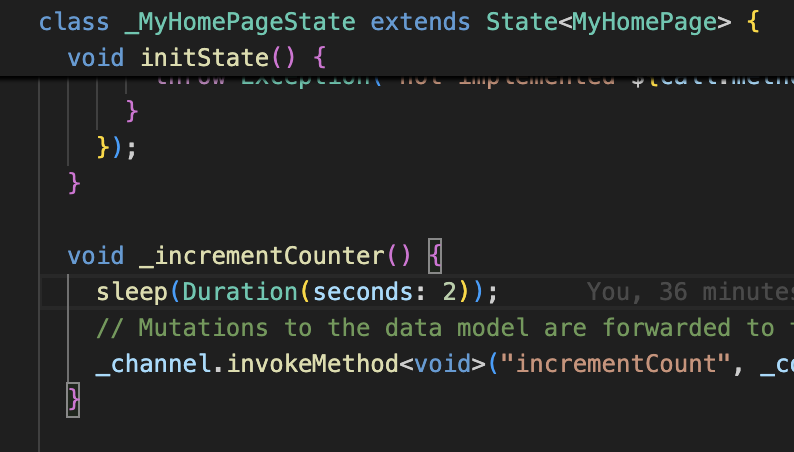
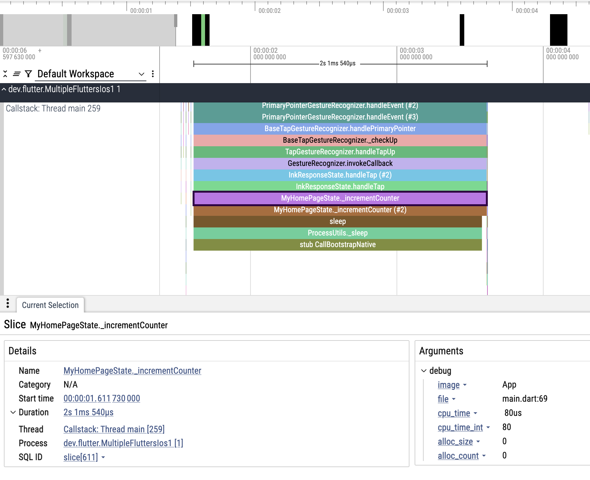

## Motivation
你可能知道Flutter iOS profile模式下跑Instruments是可以看到dart代码的堆栈的。但是使用Instruments对测试和非iOS开发同学不友好。试用了[btrace](https://github.com/bytedance/btrace)，个人感觉是个不错的工具，所以想分享一下。

## 使用btrace

按照[btrace](https://github.com/bytedance/btrace?tab=readme-ov-file#btrace-for-ios)的文档把btrace依赖到项目中（本文不赘述如何集成），这里我使用Flutter官方[add2app](https://github.com/flutter/samples/tree/main/add_to_app/multiple_flutters)的demo作为演示。

我在代码中加一个耗时方法：



perfetto的效果：



可以看到使用btrace我们可以在perfetto很好的分析方法耗时，方便我们定位Flutter的卡顿问题。
> 这个做法需要Flutter主线程和UI线程合并的情况下才能用（Flutter SDK >= 3.32.x）


对于Android的支持，目前来看，由于btrace暂时不支持Android Native C++采集，所以无法在Android上看到dart代码堆栈，但可以参考[这篇文章](https://littlegnal.github.io/2025-07-02/flutter_add-to-app-profiling-guide)开启采集build方法耗时。

## 这就完了？

你可能不知道perfetto文件是可以通过API去分析的，见 [https://perfetto.dev/docs/analysis/trace-processor-python](https://perfetto.dev/docs/analysis/trace-processor-python)。

有了perfetto文件，我们可以通过perfetto Python API获取耗时函数堆栈。下面例子查询耗时超过1s的方法：

```py
# Open the trace file (replace the path with your actual trace file)
tp = TraceProcessor(trace="my/path/output.pb")

# SQL query to select slices with execution time exceeding 1 second
sql = """
SELECT
  name,
  dur
FROM slice
WHERE dur > 1000000000
ORDER BY dur DESC
LIMIT 200
"""
qr = tp.query(sql)

# Convert the result to a list for post-processing
rows = list(qr)
if not rows:
    print("No methods exceeded 1 second in duration.")
else:
    # Determine the maximum method name length for aligned output
    max_name_len = max(len(r.name) for r in rows)

    for r in rows:
        name = r.name
        dur_ms = r.dur / 1e6
        # Pretty print: "<method_name> (<duration ms>)"
        print(f"{name:<{max_name_len}} ({dur_ms:8.3f} ms)")
```
查询结果：
```
...
RendererBinding.dispatchEvent                            (2001.540 ms)
GestureBinding.dispatchEvent                             (2001.540 ms)
GestureBinding.handleEvent                               (2001.540 ms)
PointerRouter.route                                      (2001.540 ms)
PointerRouter._dispatchEventToRoutes                     (2001.540 ms)
LinkedHashMapMixin.forEach (#2)                          (2001.540 ms)
PointerRouter._dispatchEventToRoutes.<anonymous closure> (2001.540 ms)
PointerRouter._dispatch                                  (2001.540 ms)
PrimaryPointerGestureRecognizer.handleEvent (#2)         (2001.540 ms)
PrimaryPointerGestureRecognizer.handleEvent (#3)         (2001.540 ms)
BaseTapGestureRecognizer.handlePrimaryPointer            (2001.540 ms)
BaseTapGestureRecognizer._checkUp                        (2001.540 ms)
TapGestureRecognizer.handleTapUp                         (2001.540 ms)
GestureRecognizer.invokeCallback                         (2001.540 ms)
InkResponseState.handleTap (#2)                          (2001.540 ms)
InkResponseState.handleTap                               (2001.540 ms)
MyHomePageState._incrementCounter                        (2001.540 ms)
MyHomePageState._incrementCounter (#2)                   (2001.540 ms)
sleep                                                    (1977.250 ms)
ProcessUtils._sleep                                      (1977.250 ms)
stub CallAutoScopeNative                                 (1977.250 ms)
sleep                                                    (1969.110 ms)
ProcessUtils._sleep                                      (1969.110 ms)
stub CallBootstrapNative                                 (1969.110 ms)
```

同时可以结合AI，写一个AI Agent去分析堆栈，生成各种格式的报表/图，上报内部平台，自动创建工单。。。。。。于是我们可以有这样一个流程：

测试前开启btrace，测试完之后将perfetto文件自动交给AI Agent分析，让Agent去处理报表，创建工单。

## TL;DR
借助btrace，我们可以同时采集原生（Android/iOS）和Flutter（目前只支持Flutter iOS）的堆栈，便于我们线下分析函数耗时。

感谢btrace团队的开源，让广大开发者受益。

### 参考
- [https://github.com/bytedance/btrace](https://github.com/bytedance/btrace)
- [https://perfetto.dev/docs/analysis/trace-processor-python](https://perfetto.dev/docs/analysis/trace-processor-python)
- [https://littlegnal.github.io/2025-07-02/flutter_add-to-app-profiling-guide](https://littlegnal.github.io/2025-07-02/flutter_add-to-app-profiling-guide)

